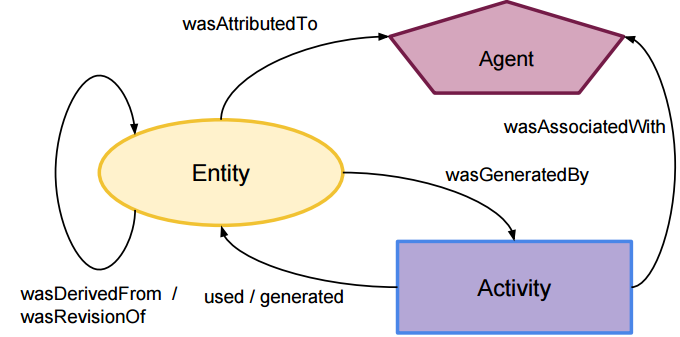
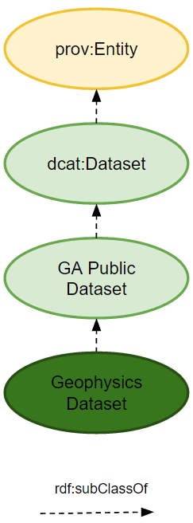
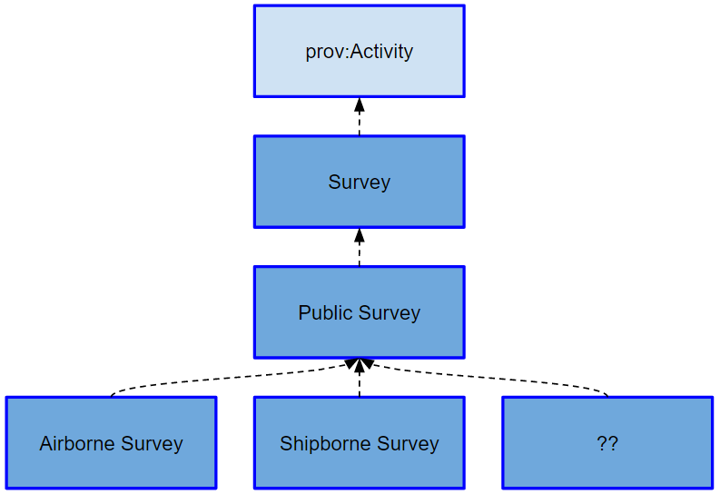
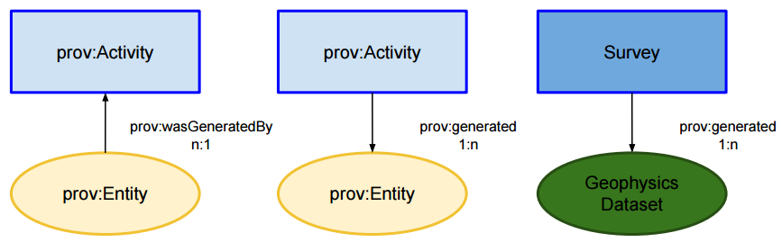
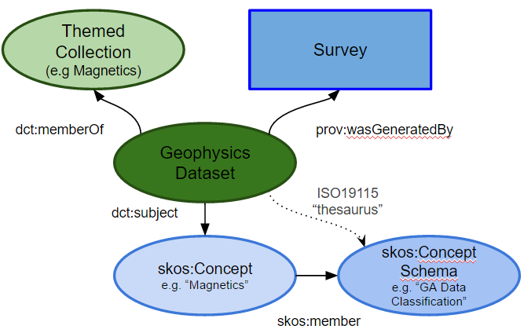
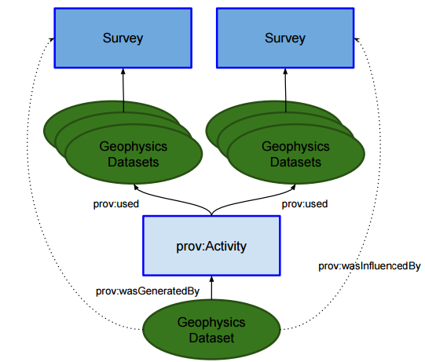
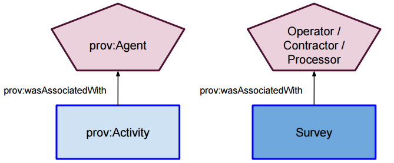
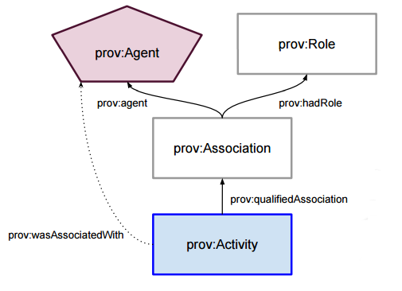
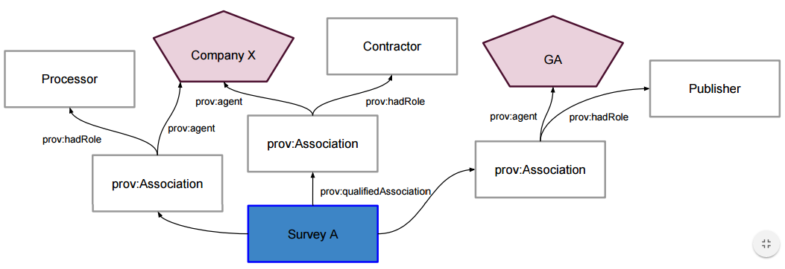

# Surveys Linked Data API
A Linked Data API for GA's geophysics Survey records.

This is a Python Flask HTTP API that provides access to metadata about Surveys stored in GA's corporate database known as ARGUS. Surveys are data collection activities undertaken by various vehicles (usually ships and aeroplanes). The data collected is of a range of types including magnetics, radiometrics and LiDAR. The data are stored at the National Computational Infrastructure (NCI) (http://www.ngi.org.au) in netCDF format and are catalogued in GA's corporate data catalogue eCat (http://ecat.ga.gov.au/geonetwork/). The data stored at the NCI and their catalogue entries contain links back to these Surveys. 

## License
This repository is licensed under Creative Commons 4.0 International. See the [LICENSE deed](LICENSE) in this repository for details.

## Contacts
Lead Developer:  
**Nicholas Car**  
*Data Architect*  
Geoscience Australia  
<nicholas.car@ga.gov.au>  
<http://orcid.org/0000-0002-8742-7730>

## Modelling
This Linked Data API outputs objects - Surveys and Registers of Surveys (collections) according to a variety of 'views' (models) and in a variety of formats. There is a native 'GA Survey' metadata model (an [OWL ontology](https://en.wikipedia.org/wiki/Web_Ontology_Language)) that we have made to cater for all the metadata we need to represent. The Linked Data API serves this model, in a variety of formats, by default with HTML being the default format.

In addition to the GA Survey model of Surveys' metadata, the Linked Data API also serves other, well known and standardised, model views of Surveys, such as a provenance view according to [PROV-O](https://www.w3.org/TR/prov-o/), the [W3C's](https://www.w3.org/) provenance ontology.

### GA Survey Model
The model used to represent Surveys is the GA Public Data Model (GAPD) which is an OWL ontology (http://pid.geoscience.gov.au/def/ont/gapd). This ontology defines the classes of things that GA delivers publicly. It inherits from well-known ontologies such as:
 
 * [PROV-O](https://www.w3.org/TR/prov-o/) - the provenance ontology
 * [Dublin Core Terms](http://dublincore.org/schemas/rdfs/) - the ontology version of the basic Dublin Core Metadata Intiative's terms (http://dublincore.org/)
 * [DCAT](https://www.w3.org/TR/vocab-dcat/) - the W3C's Data Catalog Vocabulary

### Provenance Modelling
Regarding Surveys, we are most interested in describing them (Survey metadata), describing the Datasets that they produce (Dataset metadata) and, of course, describing and then recording the Survey <--> Dataset relationships. This last point is a provenance modelling exercise.

PROV-O gives us three basic classes which Everything falls in to. Figure 1 shows those classes and their basic (unqualified) relationships.
 
  
Figure 1: The basic PROV-O classes and their relationships 

#### Survey Modelling
We model a Survey as a temporal event which, according to PROV-O, means it is a type of *Activity*. As an *Activity*, a Survey will have access to all legal *Activity* properties, such as *startedAtTime* and *endedAtTime*, *atLocation*. See [Activity in PROV-O](https://www.w3.org/TR/prov-o/#Activity) for others. 

In addition to just modelling a Survey class, we model sub-classes of Survey being a Public Survey which is a Survey that GA delivers publicly. Likely a Public Survey is a Survey with some metadata removed which aligns with the GAPD where we have classes like Dataset and then Public Dataset, see Figure 2. 

  
Figure 2: The GAPD modelling of a Geophysics Dataset 

Subclasses of Public Survey are then Airborne Survey, Shipborne Survey and possibly. This is shown in Figure 3.

  
Figure 3: The Survey class and subclasses and it's relationship to PROV-O 

Airborne-only properties, such as height above ground, will only be legal for Airborne Survey and likewise for other sorts.

#### Survey <--> Dataset
As a subclass of PROV-O's *Activity*, Surveys are related to Datasets, which are a subclass of PROV *Entity* via:

> prov:Activity *prov:generated* prov:Entity

with the inverse being:

> prov:Entity *prov:wasGeneratedBy* prov:Activity

This modelling is shown in Figure 4.

  
Figure 4: A survey is a subclass of PROV-O's *Activity*

#### Survey <--> Geophysics Dataset with classification
Geophysics Datasets are categorised by using [SKOS Concepts](https://www.w3.org/TR/skos-reference/#concepts) which are akin to [ISO19115](http://www.iso.org/iso/iso_catalogue/catalogue_ics/catalogue_detail_ics.htm?csnumber=53798)'s keywords. Aditionally, Geophysics Datasets may belong to Themed Collections. This modelling is shown in Figure 6.

  
Figure 6: Geophysics Dataset Classification and Survey

##### Data from multiple Surveys
We have datasets that are the results of multiple Surveys. We model this as per Figure 7 where there is an assumed aggregation activity, detaisl fo which may be unknonw, that mush have taken place to take some of the outputs from multiple Surveys and process them into a Geophysics Dataset.

  
Figure 7: Geophysics Dataset Classification and Survey

Since we may not know details of this assembling Activity, we don't need to record it, only assume it for modellign consistency. We may only record the Survey <--> Geophysics Dataset relationship. Unlike a 1:1 Survey <--> Geophysics Dataset relationship, we have to say a Geophysics Dataset that results from multiple Surveys *wasInfoluencedBy* those surveys, not *wasGeneratedBy* as only a single PROV *Activity* could ever generate a particular Dataset (PROV *Entity*)

##### Surveys and Agents
In order to link Surveys to relevant people or groups, which in PROV we model as *Agents*, we use the *Activity* <--> *Agent* relationship of *wasAssociatedWith*. Figure 8 shows this with specific examples.

  
Figure 8: Surveys and Agents

In order to add more information to the *Activity*/*Agent* relationship, we use the PROV standard approach of qualifying it by indicating an *Association* linking a Survey to a particular *Agent* with a particular *Role*, relevant only for that relationship (*Agents* can have multiple different roles with respect to different Associations to different or even the same dataset(s)). Figure 9 shows this construct in basic PROV terms with Figure 10 showing a specific example of a Survey with multiple Associations.
 
  
Figure 9: PROV's qualified *Activity*/*Agent* relationship

  
Figure 10: A Survey linked to two *Agents* via three *Associations* with Company X being both the Contractor and the Processor. 

## Linked Data model expression
The Surveys API delivers a *gapd* and a *prov* model view for each Survey. The *gapd* view is the default view and uses the classes and relationships described above. The *prov* view uses only PROV-O classes and relationships, thus a Survey is described as a PROV-O *Entity*.

The *wasGeneratedBy*/*generated* relationships between Surveys and Geophysics datasets are not recorded in the database that feeds this API. That relationship information is stored in GA's corporated data catalogue, [eCat](http://ecat.ga.gov.au/geonetwork/) that also contains all the Geophysics Dataset metadata.

## Catalog Location & Identification
This repo is catalogued in Geoscience Australia’s enterprise catalogue eCat. Its identifier, which is a persistent [URI](https://en.wikipedia.org/wiki/Uniform_Resource_Identifier) and which links directly to it, is <http://pid.geoscience.gov.au/dataset/ga/110081>.

It also has a DOI: [10.4225/25/59e43600ab78f](http://dx.doi.org/10.4225/25/59e43600ab78f).

## Citing this software
If you wish to cite this repo as you would a dataset, please do so like this:

Car, N.J. (2017) Surveys Linked Data API. Git software repository containing Python code. [DOI:10.4225/25/59e43600ab78f](http://dx.doi.org/10.4225/25/59e43600ab78f)